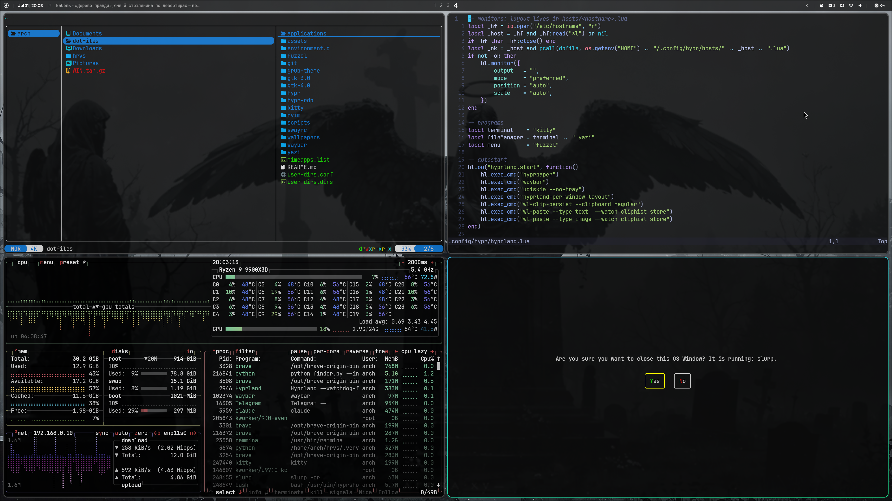

# dotfiles

Arch + Hyprland desktop configs. Single source of truth for everything deployed
to `$HOME` and `~/.config`. No secrets — see `.gitignore`.

## Layout

Mirrors `~` and `~/.config`:

- `.bashrc`, `.bash_profile` → `~`
- `hypr/`, `waybar/`, `swaync/`, `fuzzel/`, `kitty/`, `yazi/`, `nvim/`,
  `gtk-3.0/`, `gtk-4.0/`, `environment.d/`, `git/`, `hypr-rdp/`, `systemd/`,
  `wireplumber/`, `pacman/` → `~/.config/`
- `scripts/` → `~/.local/bin/`
- `applications/` → `~/.local/share/applications/`
- `wallpapers/` → `~/Pictures/wallpapers/`
- `grub-theme/` — GRUB theme, installed separately as root

## Secrets

Never committed (`.gitignore`):

- `hypr-rdp/config.toml` — RDP credentials. The repo ships
  `config.toml.example` with a placeholder:
  `cp hypr-rdp/config.toml.example hypr-rdp/config.toml`, edit, `chmod 600`.

SSH and WireGuard keys are not part of this repo.

## Session units

`systemd/user/hyprland-session.target` is what makes user units work under
Hyprland: the compositor is started by SDDM, not by systemd, so nothing else
activates `graphical-session.target` and every unit enabled into it stays dead.
`hyprland.lua` starts and stops this target, which binds the real one. After
deploying, run `systemctl --user daemon-reload` and enable what you want:

    systemctl --user enable waybar.service hyprpaper.service swaync.service

## nvim plugin versions

`nvim/lazy-lock.json` is committed to pin exact plugin versions. Re-commit it
after `lazy update`.
